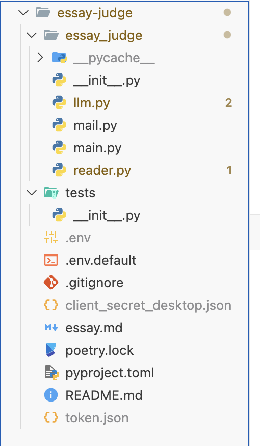

# Essay Judge

1. 確定自己的路徑在 essay-judge/ 下


2. 確定自己有client_secret_desktop.json檔案，並放在essay-judge/private下

3. 確定自己有把 `.env` 檔案放在 essay-judge/private 下

```
OPENAI_API_KEY=sk-proj-
HUGGINGFACEHUB_API_TOKEN=hf
```

4. `poetry install` : 安裝所需套件

5. `poetry run start`：執行程式


## 沒有Poetry的安裝方式

1. 安裝所需套件

```
pip install -r requirements.txt
```

2. 執行程式

```
python -m essay_judge.interface
```